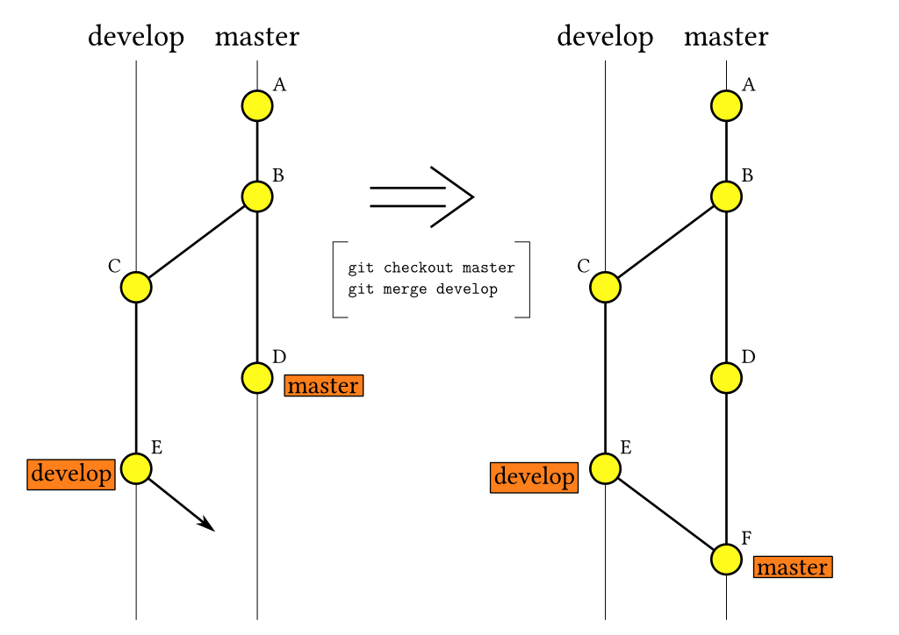
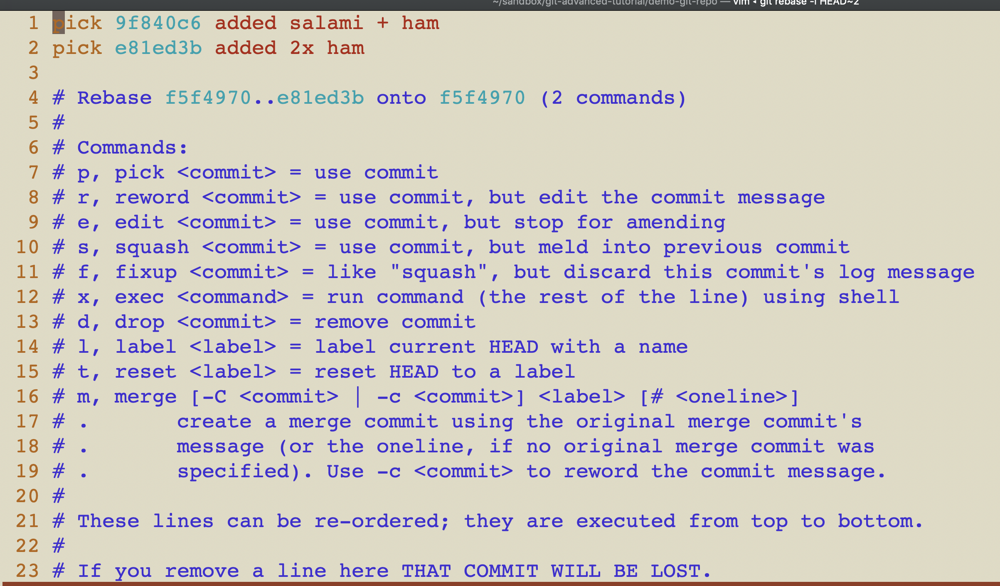

# GIT


## Table of Content
<!-- TOC depthFrom:3 -->
- [What is a Version Control Systems](#vcs)
- [Some facts about GIT ](#some_facts)
- [The three stages](#three_stages)
- [Committing](#committing)
  - [git commit --amend](#amend)
  - [Commit messages](#commit_messages)
- [Branch Basics](#branches)
  - [Moving branches](#git_reset)
- [Bringing branches together](#cp_m_r)
  - [Cherry Pick](#cherry_pick)
  - [Merging](#merging)
  - [Rebasing](#rebasing)
    - [Interactive Rebase](#interactive_rebase)
- [Getting Remote](#getting_remote)
  - [Push to remote branch](#push_remote)
  - [Force Pushing](#force_push)
  - [Sync local with remote](#updating)
- [Forensics with git reflog](#reflog)
- [Tips & Best-Practices](#tips)
  - [Useful GIT aliases](#git_aliases)
<!-- /TOC -->

<a name="vcs"></a>
## What is a Version Control Systems

* Version control systems are a category of software tools that help a software team manage changes to source code over time.
* Version control software keeps track of every modification to the code in a special kind of database.
* If a mistake is made, developers can turn back the clock and compare earlier versions of the code to help fix the mistake while minimizing disruption to all team members.
* See [Git Tutorial Atlassian](https://www.atlassian.com/git/tutorials/what-is-version-control)

<a name="some_facts"></a>
## Some facts about GIT

- Atomic working unit in GIT is a _**commit**_ identified by SHA1 hash
- _**Branches**_ are "pointers" to a certain commit. You can checkout, create, move, delete branches.
- _**HEAD**_ is a reference to the last commit in the currently check-out branch. You can think of the HEAD as the "current branch" (`cat .git/HEAD`).
- _**Tags**_ are fixed "pointers" to a commit.  


<a name="three_stages"></a>
## The three stages

Files in a repository go through _**three stages**_ before being under version control with git:

* _**Unstaged**_: file under git's version control and changes are not added to staged area (local unstaged changes)
* _**Staged**_: the file has been added to git's version control but changes have not been committed
* _**Committed**_: the change has been committed

A special state is `Untracked`. These files are not (yet) under GIT's version control.


<table><tr><td>

</td></tr></table>

### Figuring out in what stage you are

`git status`
* Shows unstaged, staged and untracked files
* Once you have committed you need to use `git log` or GIT Repository Browser.


<a name="committing"></a>
## Committing

```
$ git add <files>
$ git commit  
```

**_Rule-of-thumb_**: Commit every time when you reached a clean state (e.g. running tests). Do the commit in the same way you would press Ctrl+S in your editor!


<a name="commit_messages"></a>
#### Commit messages
Use editor for committing to write commit message instead of `git commit -m "your message"`.
By that you can add more comprehensive documentation to your commits.
Configure your editor of your choice like that:
```
git config --global core.editor vim
```
Check with `git config -l` your config (your config file you can find under `~/.gitconfig`).

<a name="amend"></a>
#### git commit --amend
Replace the tip of the current branch by creating a new commit.
By that you can add changes to the previous commit but a new commit (Hash) will be created.


Advanced committing options with interactive rebase (See "Interactive Rebase").

<a name="branches"></a>
## Branch Basics

**Note:** You always have checked out a certain commit (see HEAD)!

**_It's Best-Practice to have always a (local) branch pointing to your checked out commit._**

## Why branches ?

* Different branches can point to different commits but you always have checked out just commit!
* With branches you can easily switch between different commits of your source-code (_switch versions_).

### List branches

`git branch [-v]`
* will list all local branches
* -v = verbose showing commit infos

### Create new branches

`git checkout -b new_branch_name`
* will update HEAD to set the specified branch (here `new_branch_name`) as the current branch

### Checkout existing branch

`git checkout existing_branch_name`
* You need to know what branch to checkout. Use `git branch [-v]` for that!

### Delete branches

`git branch -d branch_name`

* The -d option stands for --delete, which would delete the local branch, only if you have already pushed and merged it with your remote branches.

`git branch -D branch_name`
* The -D option stands for --delete --force, which deletes the branch regardless of its push and merge status, so be careful using this one!

<a name="git_reset"></a>
### Moving branches

`git reset` moves current HEAD to the specified state (Moving branch to a specific commit). With options you can specify what happens to the changes/commits during reset.

`git reset [mode] where mode = hard|soft|mixed`

* hard = changes will be removed
* soft = changes will kept staged
* mixed = changes will be kept unstaged

<a name="cp_m_r"></a>
## Bringing branches together

There are 3 ways to bring commits from one branch to another:
* man git-**cherry-pick**
* man git-**merge**
* man git-**rebase**

<a name="cherry_pick"></a>
### Cherry Pick
Pick any commit(s) from another branches and set it on the tip of the HEAD.
`git cherry-pick <commit>`

<a name="merging"></a>
### Merging

See `man git-merge`

<table><tr><td>

</td></tr></table>


<a name="rebasing"></a>
### Rebasing

git-rebase sets HEAD (here **feature** with commit **E** and **F**) with all commits from common base (here base commit is **B**) to the tip of another branch (here commit **D** of master).

<table><tr><td>

</td></tr></table>

```
git checkout feature
git rebase master
```
In case of merge conflict during rebase, resolve conflict, add file and then continue with `git rebase --continue`.
If you want to abort the rebase then use `git rebase --abort`.

* The major benefit of rebasing is that you get a much cleaner project history. You get a linear project history.

<a name="interactive_rebase"></a>
#### Interactive Rebase

Interactive rebasing gives you the opportunity to alter commits as they are moved to the new branch. By that you can change the branch commit history.

```
git checkout feature
git rebase -i master
```
By interactive rebase you can change your local commit history.

```
# interactive rebase for the last 2 commits of HEAD
git rebase -i HEAD~2
```
<table><tr><td>

</td></tr></table>

<a name="getting_remote"></a>
## Getting remote

<a name="push_remote"></a>
### Push to remote branch
```
# This will push local 'master' to remote branch 'new'
# Branch will be created remotely in case it doesn't exist
git push origin master:new
```

<a name="force_push"></a>
### Force Pushing
```
# NEVER DO THIS! GIT HOOKS CAN AVOID THIS!
git push -f origin  master
```
But when changing your own feature branch locally , i.e. by interactive rebase, which you have pushed before, a `git push -f origin my-private-feature-branch` can be ok. _But be sure what you're doing! You overwrite the remote feature branch!!!_

<a name="updating"></a>
### Sync local with remote

* **git remote update** - will update all of your branches set to track remote ones, but not merge any changes in.

* **git fetch** - will update only the branch you're on, but not merge any changes in (`git remote update = git fetch --all`).

* **git pull** - will update and merge any remote changes of the current branch. This will change your local state! (`git pull = git fetch + git merge.`). See also [Fast-Forward Merge](#merge_ff)

<a name="merge_ff"></a>
#### Fast-Forward Merge

* Git by default will try to merge a branch in a fast-forward mode which looks in the end like a `rebase`. BUT when you encounter merge-conflicts during pull, GIT will create
a merge-commit.
* Non fast-forward merge keeps the notion of explicit branches . It may complicate the commit history with its non-linear outcome at the price of preserving the source of the branches.
* Fast-forward merge keeps the change-sets in a linear history, making it easier to use other tools (log, blame)

<table><tr><td>

</td></tr></table>

* More on [Merge-Fast-Forward](https://ariya.io/2013/09/fast-forward-git-merge)

**_My recommendation_:**

* Use `git pull --rebase` or `git remote update` and `git rebase origin/<branch_to_rebase_on>` or ```git config --global branch.autosetuprebase always```. This avoids a merge commit and keeps your changes on top of the master branch with linear history. Yet you still have to resolve any occurring merge conflicts.

<a name="reflog"></a>
## Forensics with git reflog

Reflog is a mechanism to record when the tip of branches are updated.
This command is to manage the information recorded in it. This command shows is a list of commits that Git still has in its storage.  
See `man git-reflog` for more details.

With `git reflog --all` you can see all reference modifications from you local repository. By that you can rescue "lost" commits which might be "invisible" after resetting branches accidentally.
```
$ git reflog --all  # find commit ID of your lost commit -> here ba7abb5
...
$ git checkout -b my-branch ba7abb5
Switched to a new branch 'my-branch'  # YEAH, rescued
```


<a name="tips"></a>
## Tips & Best-Practices

* Use a GIT Repository Browser of your choice (SourceTree, GitKraken, IDE-Plugins etc.) to get an overview over commit history and branches.

* Continuously update your local repo (`git remote update` / `git fetch`).

* Commit early and often, even when changes are not final! In case the commit history looks shabby, you know now how to fix that ;-) (`git rebase -i HEAD~x`)
  - **_Rule-of-thumb_**: Commit every time when you reached a clean state (e.g. running tests). Do the commit in the same way you would press Ctrl+S in your editor!


* Best tutorials:
  - `man git-<command>`
  - https://git-scm.com/
  - https://www.atlassian.com/git/tutorials
  - http://gitready.com/

<a name="git_aliases"></a>
### Useful GIT aliases

Put these aliases into your profile file (i.e. .bash_profile).

```
# git aliases
alias gk='gitk --all'
alias gs='git status'
alias gca='git commit --amend'
alias gb='git branch -v && git remote -v show'
alias gru='git remote update'
alias grc='git rebase --continue'
alias grm='git rebase origin/master'
alias gp='git pull --rebase origin master'
```
